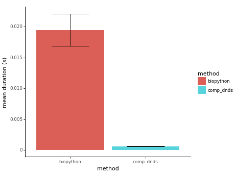

# comp_dnds

Efficiently computing dN/dS according to the Nei-Gojobori(1986)[^1] method

```python
from comp_dnds import dnds

d = dnds()
ref_seq = "ATG AAA CCC GGG TTT TAA".replace(" ", "")
obs_seq = "ATG AAA CGC GGC TAC TAA".replace(" ", "")
dn, ds, z, p = d.compute(ref_seq, obs_seq)
ω = dn/ds
print(round(ω, 2))
# 0.12
```

For longer more realistic sequences, it is also possible to compute the significance of ω, using bootstrap resampling.
The Z-score and the p-value are computed using the method described by Nei&Kumar(2000)[^2]

```python
d = dnds()
ref_seq = "GCC GGG GGA AGG ACA TAT CTC GCT CCA CCT AAT GGA ATC ATC GGT".replace(" ", "")
obs_seq = "GAC GGC CGA GGG GCA AAT CGC ACT ACA ACT ACT GAA GTC ATC AGT".replace(" ", "")
dn, ds, z, p = d.compute(ref_seq, obs_seq, bootstrap=1000)
print(f"ω= {round(dn/ds,2)} - z-score= {round(z,2)} - p-val= {round(p, 5)}")
# ω= 6.91 - z-score= 3.72 - p-val= 0.0002
```

## Installation

```bash
pip install comp_dnds
```

## Background

To compute the dN/dS ratio using the Nei-Gojobori(1986)[^1] method, one needs an observed, and a reference, or ancestral sequence. The observed sequence is typically the one from your sample/experiment, while the reference/ancestral sequence can be inferred with ancestral state reconstruction, for example using [IQ-TREE](http://www.iqtree.org/doc/Command-Reference#ancestral-sequence-reconstruction).

The dN/dS ratio, often represented as ω (omega), is a metric used in molecular biology and evolutionary biology to measure the selective pressure acting on a protein-coding gene. It compares the rate of non-synonymous substitutions (dN) to the rate of synonymous substitutions (dS) in coding sequences.

**Non-synonymous substitutions (dN)**: These are mutations that change the amino acid in a protein. They can potentially affect the protein's structure and function, and therefore they can be subject to natural selection.

**Synonymous substitutions (dS)**: These are mutations that do not change the amino acid in a protein. Because they don't change the protein's structure or function, they are often considered to be selectively neutral, or at least under less selective pressure than non-synonymous changes.

> The dN/dS ratio provides insight into the evolutionary forces acting on a gene:

- **dN/dS = 1**: The rate of non-synonymous substitutions is about the same as the rate of synonymous substitutions. This suggests that the gene is evolving under neutral evolution. 

- **dN/dS < 1**: The rate of non-synonymous changes is lower than the rate of synonymous changes. This suggests that the gene is under purifying or negative selection. Negative selection acts to remove deleterious mutations. 

- **dN/dS > 1**: The rate of non-synonymous changes is higher than the rate of synonymous changes. This suggests that the gene is under positive or adaptive selection. This means that non-synonymous changes provide some advantage and are being selected for.

## Benchmark

  
Figure 1: Average time taken by biopython `cal_dn_ds` and `comp_dnds` to compute the dN and dS value for a sequence of length 999 nucleotides. The lower the better.

`comp_dnds` produces identical results to the [`cal_dn_ds`](https://biopython.org/docs/1.75/api/Bio.codonalign.codonseq.html#Bio.codonalign.codonseq.cal_dn_ds) implementation of biopython, while being on average 32X faster than biopython. Detailed benchmark in [notebooks/benchmark.ipynb](notebooks/benchmark.ipynb)


[^1]: [Simple methods for estimating the numbers of synonymous and nonsynonymous nucleotide substitutions](https://doi.org/10.1093/oxfordjournals.molbev.a040410)  
[^2]: Nei, M., & Kumar, S. (2000). Molecular evolution and phylogenetics. Oxford University Press, USA. Page 55